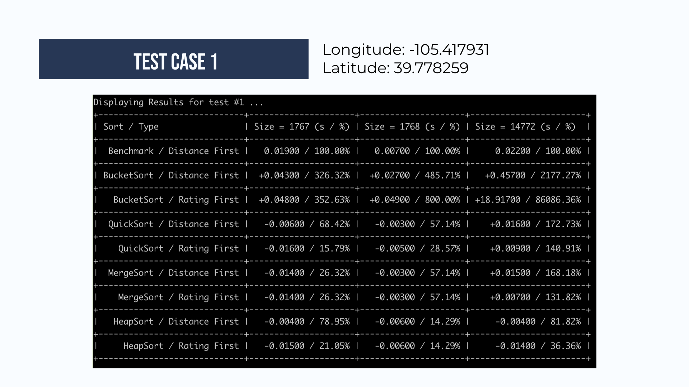
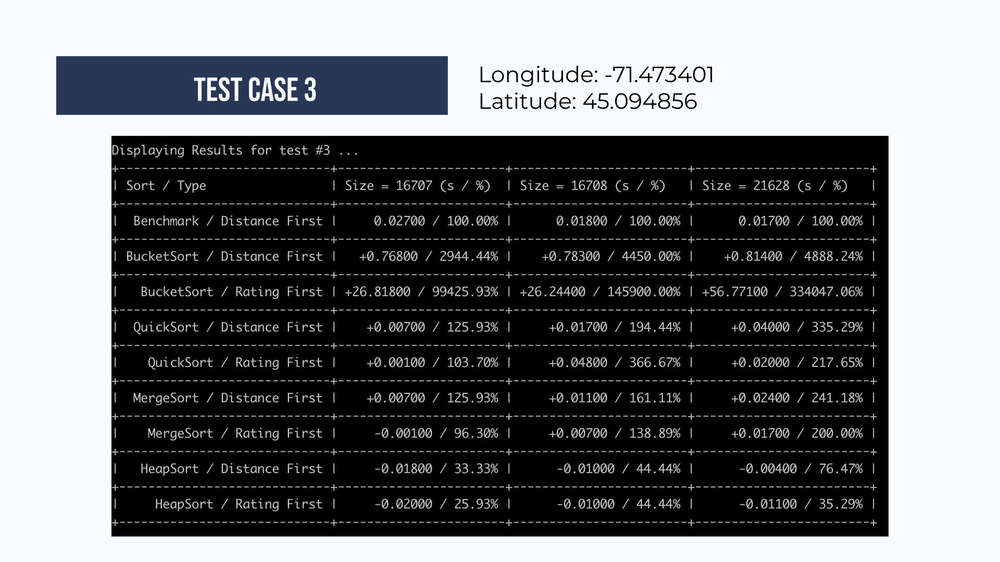

# CS201-DSA-Project

Data Structure and Algorithm (DSA) Project for CS201 Module - done by G3T3.

## About

This repository contains the source code which is used for testing the various sorting algorithms and data structures.

### Problem Statement

Given the current time and the maximum distance willing to travel, which is the best (most highest rated) restaurant currently open?

## Getting Started

### Requirements

To setup the project, you will need the [yelp academic business dataset](https://www.yelp.com/dataset) to be placed in the root directory of this folder.
Additionally, JDK version 11 and above is required.

### Setup

```bash
git clone https://github.com/L0uisJ0shua/CS201-DSA-Project
cd CS201-DSA-Project

# For Mac / Linux
./compile.sh && ./run.sh

# For windows
./compile.bat
./run.bat
```

### Structure

The project utilises the following structure

| Directory      | Use case                                    |
| -------------- | ------------------------------------------- |
| /src/main/java | The location the Java source code is stored |
| /lib           | The location of imported jar files          |
| /target/class  | The location for class files                |

Within the /src/main/java directory:

| Directory   | Use case                                                                           |
| ----------- | ---------------------------------------------------------------------------------- |
| /algo       | Implementation of the various sorting algorithms                                   |
| /app        | Contains Main, DTOs and various testing services                                   |
| /datastruct | Contains the classes for custom implementations of various data structures         |
| /Utils      | Helper functions to store data and results, and parse data and calculate distances |

## Methodology

Test out the time taken for sorting the dataset to obtain the results using different sorting algorithms. Each sorting algorithm is further split into sorting by ratings (stars) followed by distance and by distance followed by ratings.

Each algorithm is then benchmarked against an implementation using Java's TreeMap and TimSort.

The space-time trade-off is also experimented with using different bucket sizes in Bucket Sort - size of 6 for rating sort and 10,000 for distance sort.

## Algorithms

### Sort

- [x] Bucket Sort
- [x] Merge Sort
- [x] Quick Sort
- [x] Heap Sort

## Data Structures

- [x] Tree (Java + Custom implementations)
- [x] Heap
- [x] LinkedList
- [x] Arrays
- [x] Vectors (of sizes 6 and 10,000)

## Results

Here are the results for a test ran on 15:18H on 4th Nov 2021, Thursday.






### Known issues

- There could be randomised longitudes and latitudes such that there are no nearby restaurants.
- Some sorts might return different results despite being internally consistent. This is likely due to the unstable nature of heap sort and quick sort.
- Timing inconsistencies observed can potentially be explained by caching mechanisms

## Acknowledgements

Thanks to Yelp for the great and wonderful dataset for our project.
